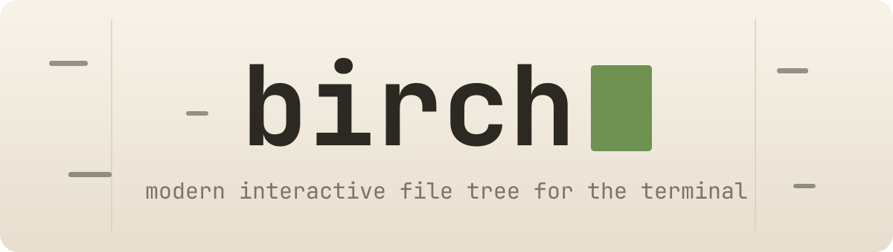
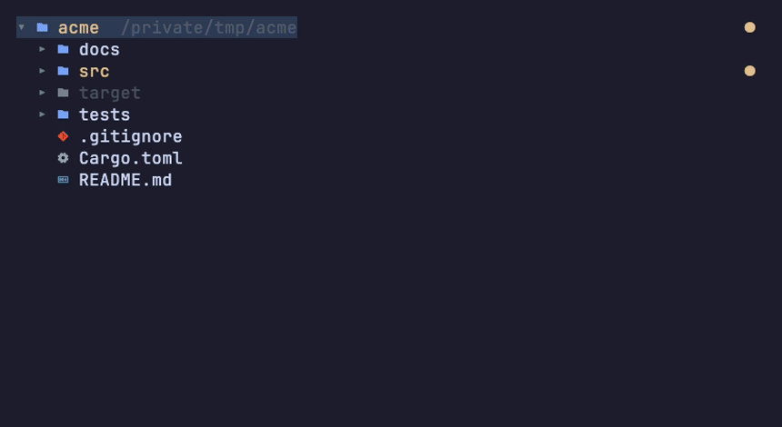
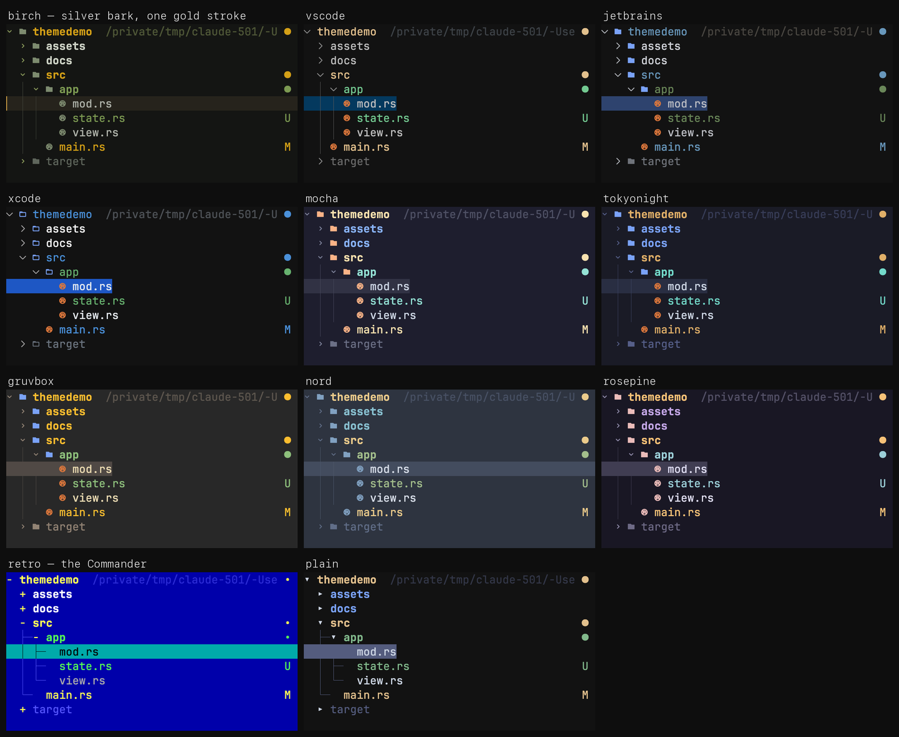

# birch — modern interactive file tree for the terminal

<p align="center">
  
</p>

[](https://github.com/slukyano/birch/actions/workflows/ci.yml)
[](https://github.com/slukyano/birch/releases/latest)
[](LICENSE)

birch is inspired by the file tree views in code editors and brings that experience to the
terminal as a standalone tool. It's purpose-built as a side view for agentic coding in tools like
herdr, cmux, and tmux, and works just as well as an everyday file explorer and picker. Written in
Rust.



## Features

- **Everyday file explorer and picker** — live tree, git status, auto-hides noise (`.git`, `.DS_Store`).
- **Built for agentic coding** — integrates as a side pane inside herdr, cmux, or tmux.
- **Modern UX** — mouse-native, Nerd Font icons, fuzzy search.

## Quick Start

```sh
brew install slukyano/tap/birch     # see Install for other methods

birch                               # interactive tree rooted at the current directory
birch ~/code                        # ...or at a given directory

nvim "$(birch --pick)"              # pick a file and open it
```

Arrows navigate: `→` expands a folder, splits a compacted chain, or else moves down; `←` collapses
or jumps to the parent. `Enter` opens a file (or toggles a directory).
Type anything for a fuzzy search. `Esc` or `Ctrl-C` quit.

## Install

**Homebrew** (recommended):

```sh
brew install slukyano/tap/birch
```

**cargo** (needs a Rust toolchain) — installs the `birch` binary only, not the `contrib/` adapters:

```sh
cargo install --git https://github.com/slukyano/birch birch
```

**From source:**

```sh
cargo build              # or: cargo run -p birch
```

A terminal with a Nerd Font gives the icons; `--no-icons` works everywhere. Git statuses need `git`
on PATH and degrade to a plain tree without it. Installed via Homebrew, the contrib adapters land in
`$(brew --prefix)/share/birch/` (not on PATH).

**Set a `Mono` Nerd Font as the terminal's primary font** — `JetBrainsMono NFM`, `Hack Nerd Font
Mono`, and so on. It is not enough for *some* installed font to have the icons: when the primary
font lacks them, the terminal substitutes a symbols-only font whose glyphs are 1.1–1.7 cells wide
and sit off-centre, so chevrons drift right of the indent guides and icons overflow their column.
Ghostty (and cmux, which embeds it) ships exactly such a fallback by default, so the family must be
set explicitly. Note that Nerd Fonts abbreviates its family names — `NFM` is the `Mono` build, `NF`
is not — and a name the terminal cannot resolve fails silently back to the substitute. Details and
measurements: [Nerd Font glyph reference](docs/research/nerd-font-glyphs.md).

## Opening files

`Enter` (or a double-click) runs the open command on the selected file. By default that is
`$VISUAL {}`, else `$EDITOR {}`, else the platform opener (`open` on macOS, `xdg-open` elsewhere).
A `$VISUAL`/`$EDITOR` open runs in **terminal mode**: birch hands the terminal over and waits, so
terminal editors like `nvim` work normally; the platform opener is spawned detached.

Override the command with `--open-cmd '<template>'`, where `{}` is the file path (appended if you
omit it):

```sh
birch --open-cmd 'nvim {}'
birch --open-cmd 'code -r {}'
```

(Host adapters pass `--open-detached` to make an open fire-and-forget — see
[Host integration](#host-integration).)

## Picker

`birch --pick` turns birch into a chooser: search and navigate exactly as in the pane — the tree
stays put, non-matching rows dim and cannot be selected, `↑`/`↓` step between matches — and `Enter`
prints the selection (a file **or** a directory) to stdout and exits. The UI stays on stderr, so
stdout carries only the picked path.

```sh
nvim "$(birch --pick)"        # pick a file to open
cd "$(birch --pick)"          # pick a directory to cd into
```

### Filtering

`--filter <glob>` narrows the tree to what you care about — in the picker and in the everyday
tree alike. It is repeatable, and an entry passes if it matches any pattern:

```sh
birch --pick --filter '*.md'                     # only markdown is pickable
birch --pick --filter '*.{md,txt}'               # brace expansion works
birch --pick --filter '*/'                       # directories only
birch --filter 'src/**/*.rs' --filter-mode hide  # a Rust-only view of src/
```

Patterns read as they do in a shell or a `.gitignore`: without `/` a pattern matches the file
**name**, with `/` inside it the **path** below the root, and with a **trailing** `/` it names
**directories** — so `*/` is "any directory".

Non-matching **files** are greyed out and cannot be selected (`--filter-mode skip`, the default) or
left out entirely (`hide`). **Folders are never greyed out and never hidden** — the tree has to stay
walkable to reach what does match, and since it loads lazily, "this folder holds nothing" is a fact
that would arrive mid-browse and make rows vanish under the cursor. In `--pick`, a folder can only
be confirmed when a pattern names it. Typing a search query narrows further, always inside the
filter.

## Themes

birch ships eleven built-in themes: its own flagship plus editor looks, popular terminal
schemes, and two throwbacks.



```sh
birch --theme mocha            # pick at launch
birch ctl set theme gruvbox    # switch a running instance
```

| theme | look |
|-------|------|
| `birch` *(default)* | Silver bark with a single gold stroke — desaturated silver-green tree, sage icons, depth-fading guides, one gold selection bar. |
| `vscode` `jetbrains` `xcode` | The editors' file trees, measured from the real apps — layouts, chevrons, icon families, and selection colors included. |
| `mocha` `tokyonight` `gruvbox` `nord` `rosepine` | The community schemes, from their official palettes. |
| `retro` | The Commander: DOS-blue canvas, black-on-cyan cursor bar, `+`/`-` tree marks, no icons. |
| `plain` | No icons, ANSI-safe colors — works on any terminal, no Nerd Font needed. |

Set a permanent default with the `theme` key in the [config file](#configuration).

## Configuration

Personal defaults live in `~/.config/birch/birch.toml` (or `$XDG_CONFIG_HOME/birch/birch.toml`);
`--config <path>` points at an explicit file. Precedence: config file < CLI flags < `birch ctl set`
at runtime. All keys are optional:

```toml
theme = "birch"        # birch | vscode | jetbrains | xcode | mocha | tokyonight
                       #   | gruvbox | nord | rosepine | retro | plain
icons = true           # Nerd Font icons
git = true             # git status badges
hidden = true          # show dot-files
ignored = true         # show gitignored entries (dimmed)
noise = false          # show .git, .DS_Store, ...
compact = true         # compact single-child folder chains
mouse = true           # mouse support
scroll-lines = 3       # rows per mouse-wheel tick (1-10)
open-cmd = "nvim {}"   # open command template ({} = path)
```

Boolean CLI flags are bidirectional (`--icons`/`--no-icons`, `--show-hidden`/`--hide-hidden`, …),
so the command line can override the config in either direction.

## Host integration

birch is built to live in a pane next to your editor and integrate with its host — a multiplexer
or window manager. The pattern is: the host spawns birch in a side pane; birch **opens** files
back in the host's main pane; and the host can make the tree **follow** your editor (reverse
integration, IDE-style). The whole contract birch asks of a host is small, so adapters are about a
screen of shell each.

Reference adapters ship in [`contrib/`](contrib); the full pattern and editor recipes (nvim,
emacsclient, VS Code) are in [`docs/integrations.md`](docs/integrations.md).

### herdr

[`contrib/birch-herdr`](contrib/birch-herdr) — `open` / `toggle` / `socket` over herdr's pane CLI
(`pane split/run/close`).

### cmux

[`contrib/birch-cmux`](contrib/birch-cmux) — integrates via cmux's right-sidebar **Dock**: one
birch per window, file previews open as tabs in the main pane, and the tree re-roots as you switch
workspaces ([ADR 0016](docs/adr/0016-cmux-integrates-via-the-dock.md)).

### tmux

[`contrib/birch-tmux`](contrib/birch-tmux) — a side pane over `split-window` / `send-keys`. Suggested
binding:

```tmux
bind-key b run-shell "birch-tmux toggle #{pane_current_path}"
```

Mouse support inside tmux needs tmux mouse mode (`set -g mouse on`).

### Build your own

The host contract: the [NDJSON socket protocol](docs/adr/0011-ndjson-protocol.md), `birch --socket
<path>` (the host picks the path, so it never has to discover what it created), `--open-cmd
'<template>'` with `--open-detached` for fire-and-forget opens, and clean exit on SIGHUP. To make
the tree follow the editor, a file-focus hook calls
[`birch ctl reveal`](#controlling-a-running-instance). See
[`docs/integrations.md`](docs/integrations.md).

## Controlling a running instance

Every birch instance listens on a control socket, and `birch ctl` talks to it. This is an advanced
surface — mostly driven by host adapters rather than run by hand:

```sh
birch ctl reveal src/main.rs   # select and scroll to a path — this is how the tree follows an editor
birch ctl set git off          # flip a setting: hidden | ignored | noise | icons | compact | git | theme
birch ctl get-path --abs       # print the current selection
birch ctl quit                 # exit the instance
```

`birch ctl` finds the target instance from `$BIRCH_SOCKET`, else by walking up from the current
directory (or point it with `--socket <path>`). It speaks the additive
[NDJSON socket protocol](docs/adr/0011-ndjson-protocol.md), and it is control-only — the socket
never mutates files.

## Development

Build, test, and contribution guidance is in [`CONTRIBUTING.md`](CONTRIBUTING.md). The product and
architecture spec — including the scope fence — is [`docs/design.md`](docs/design.md).

## Trademarks

Visual Studio Code, JetBrains, IntelliJ IDEA, and Xcode are trademarks of Microsoft, JetBrains,
and Apple respectively. birch is not affiliated with, endorsed by, or sponsored by any of them;
theme names describe only the look each theme emulates.

## License

[MIT](LICENSE)
